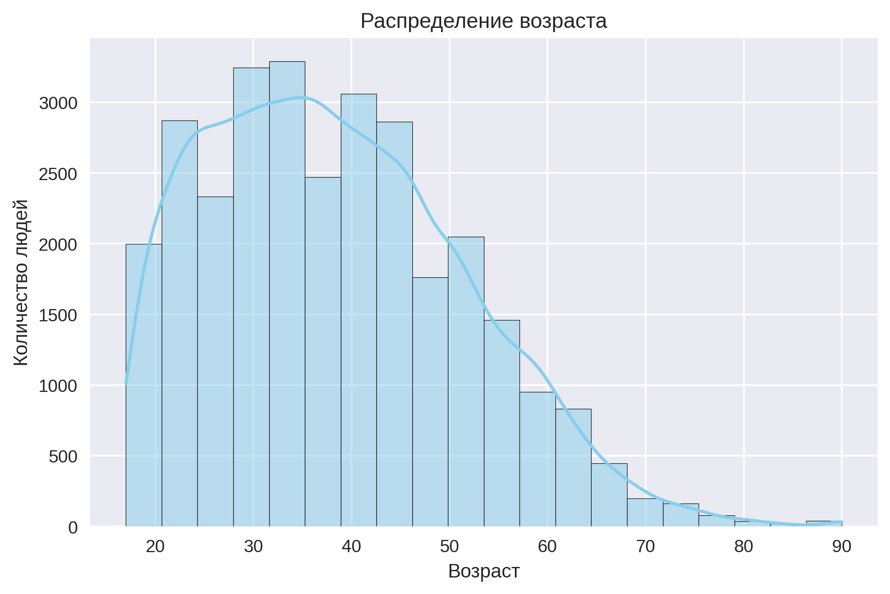
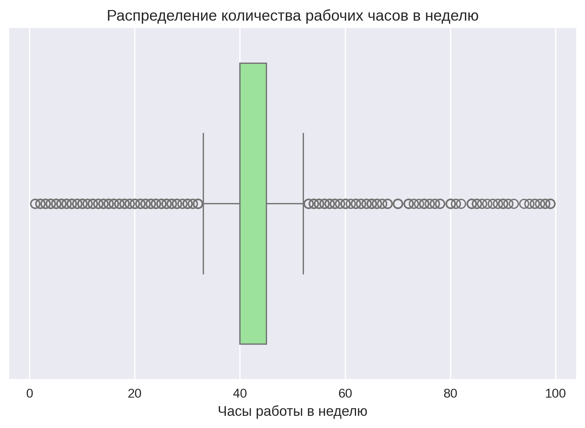
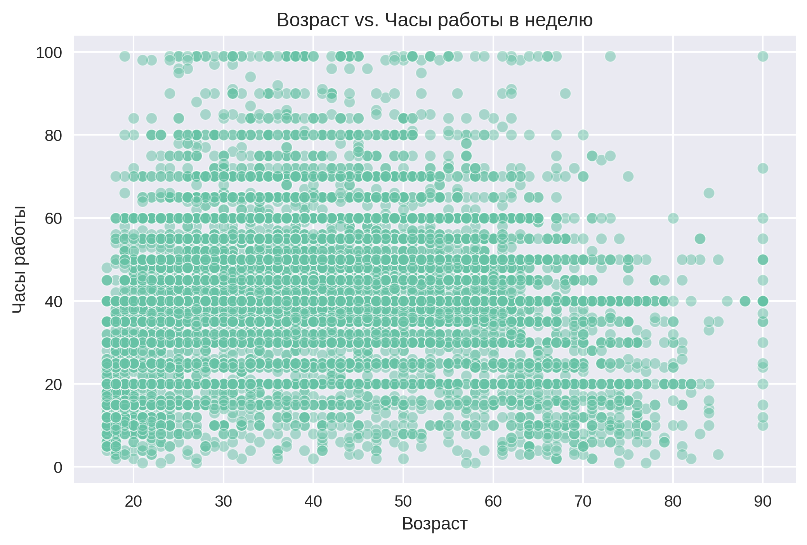
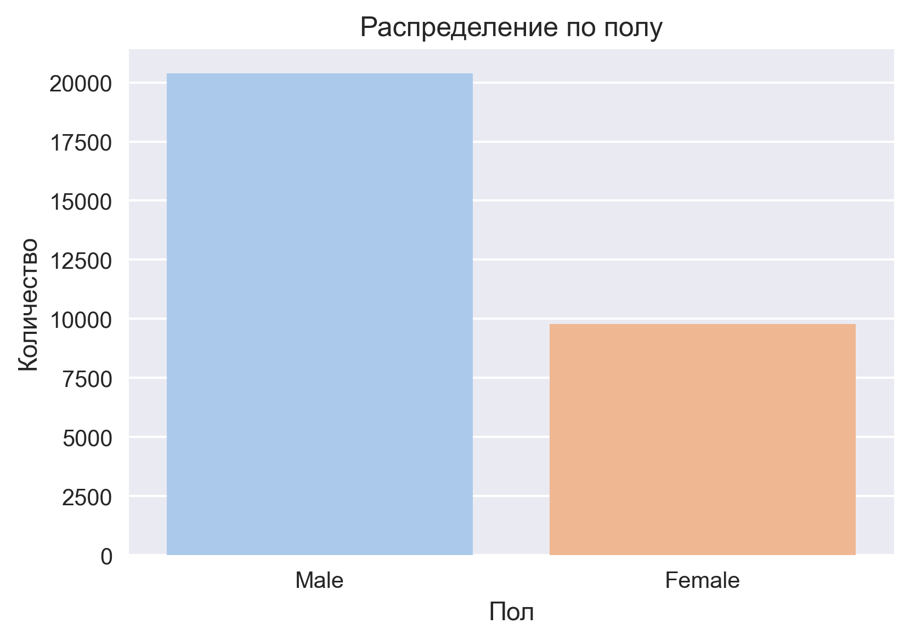
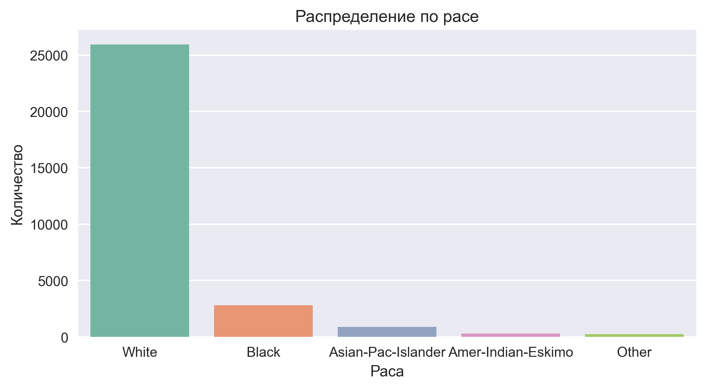
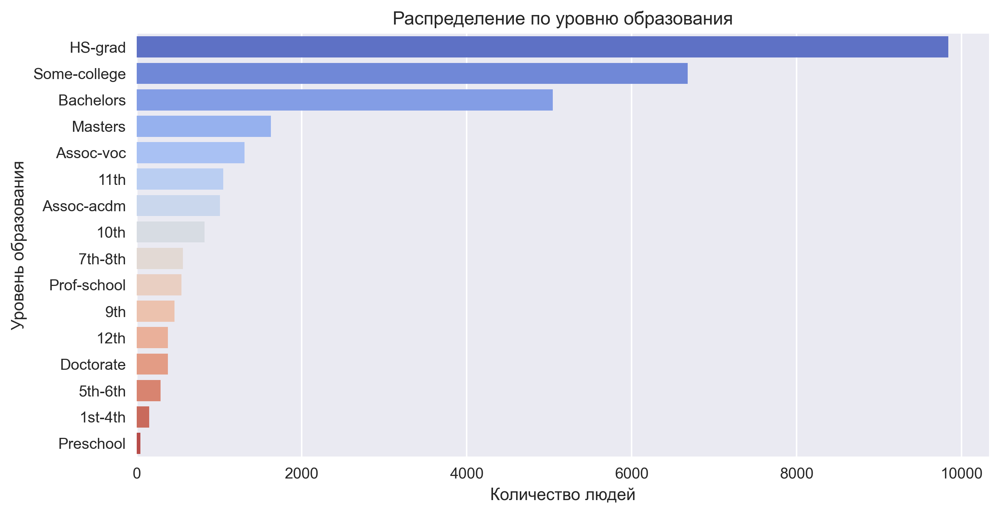
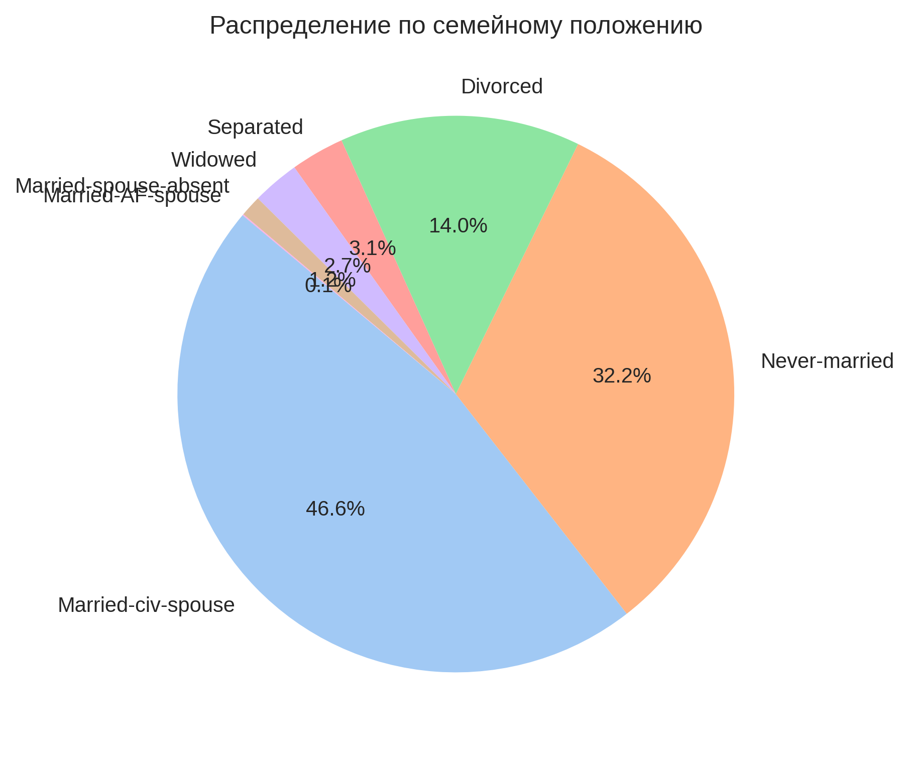

# Data EXploration

[<- Back](./../../README.md)


Статистика по age:
```sh
Среднее: 38.44, Медиана: 37.0, Мода: 36, Мин: 17, Макс: 90, Диапазон: 73

```


Статистика по fnlwgt:
```sh
Среднее: 189793.83, Медиана: 178425.0, Мода: 203488, Мин: 13769, Макс: 1484705, Диапазон: 1470936

```


Статистика по hours-per-week:
```sh
Среднее: 40.93, Медиана: 40.0, Мода: 40, Мин: 1, Макс: 99, Диапазон: 98

```


Статистика по education-num:
```sh
Среднее: 10.12, Медиана: 10.0, Мода: 9, Мин: 1, Макс: 16, Диапазон: 15

```


Статистика по capital-gain:
```sh
Среднее: 1092.01, Медиана: 0.0, Мода: 0, Мин: 0, Макс: 99999, Диапазон: 99999

```


Статистика по capital-loss:
```sh
Среднее: 88.37, Медиана: 0.0, Мода: 0, Мин: 0, Макс: 4356, Диапазон: 4356

```


Статистика по hours-per-week:
```sh
Среднее: 40.93, Медиана: 40.0, Мода: 40, Мин: 1, Макс: 99, Диапазон: 98

```
- Распределение возраста:
  - 
- Распределение количества рабочих часов в неделю:
  - 
- Возраст vs. Часы работы в неделю:
  - 
- Распределение по полу:
  - 
- Распределение по расе:
  - 
- Распределение по уровню образования:
  - 
- Распределение по семейному положению:
  - 
