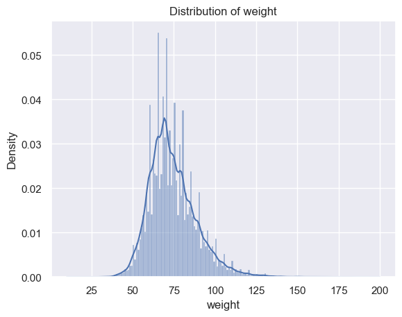
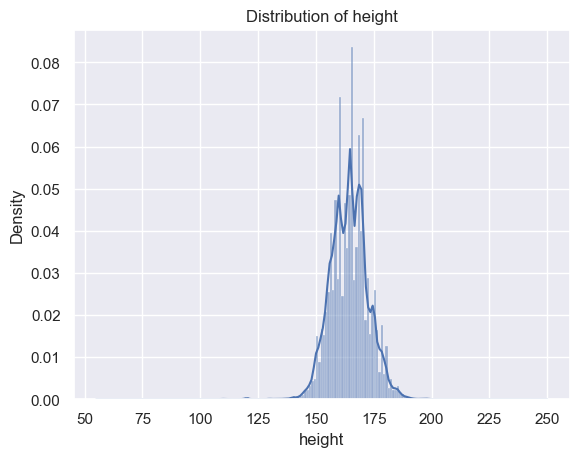
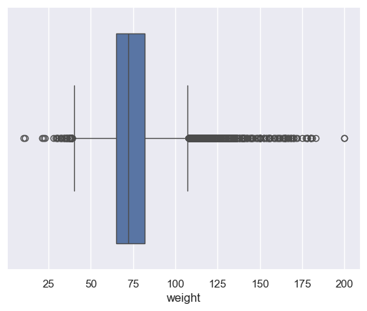
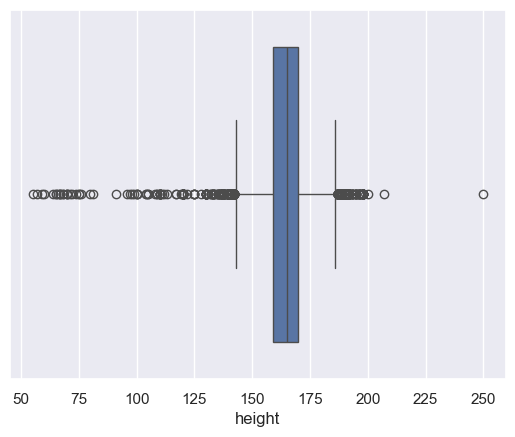
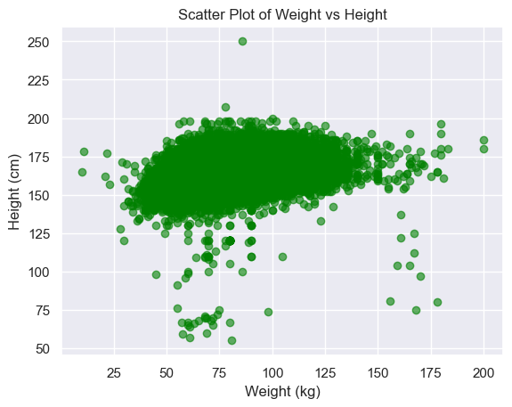
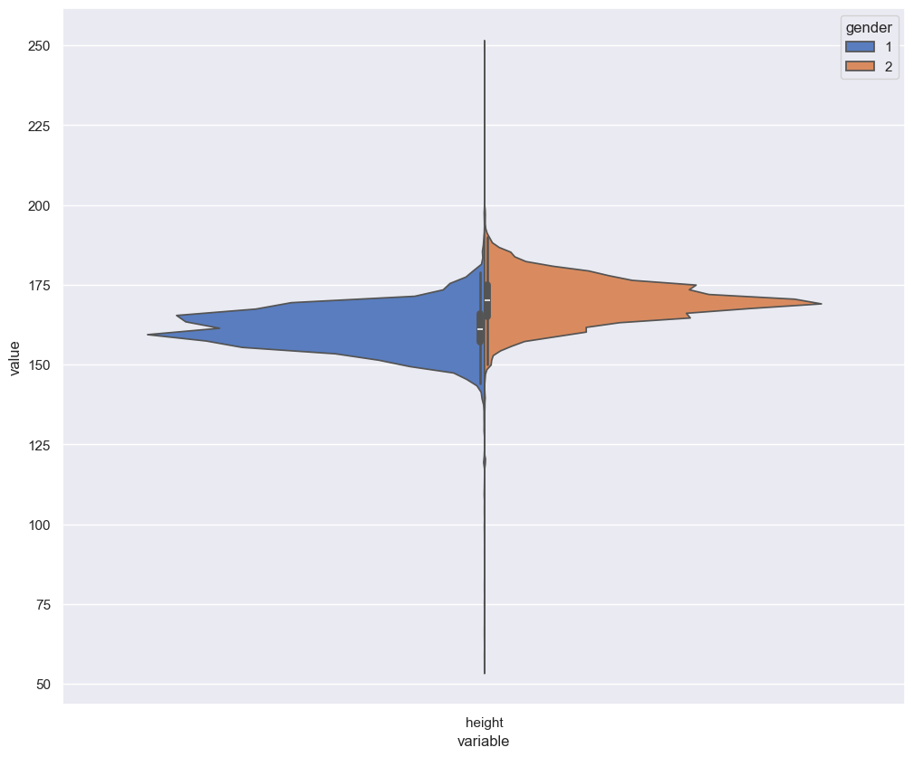
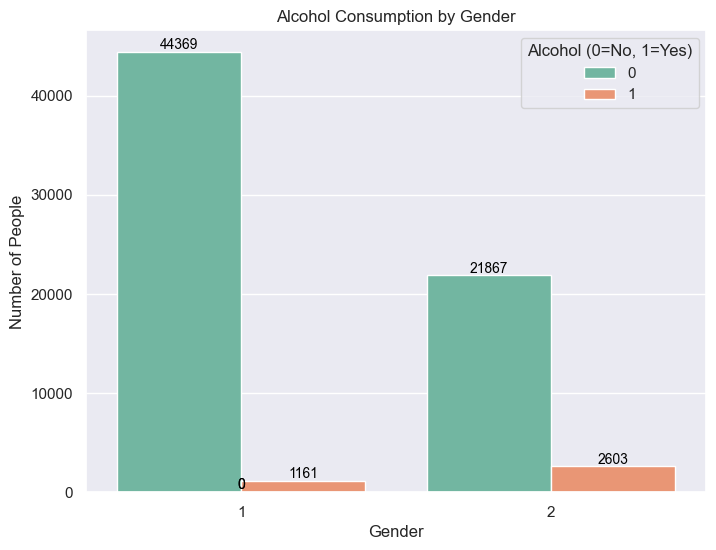
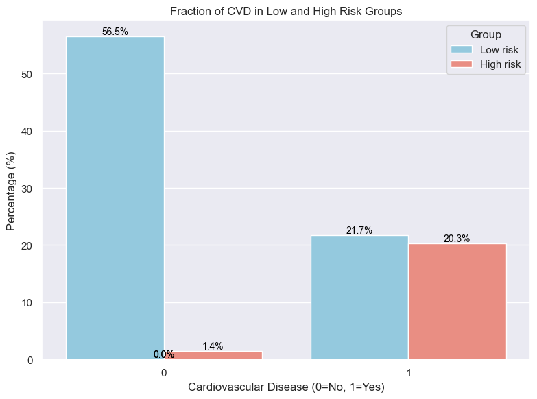
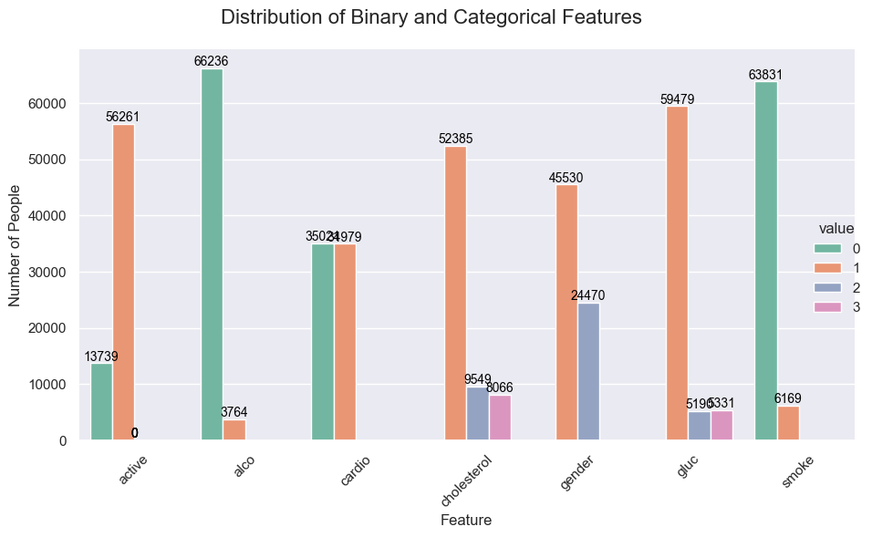

## 1. Single variable shape and distribution
```
   id    age  gender  height  weight  ap_hi  ap_lo  cholesterol  gluc  smoke  alco  active  cardio
0   0  18393       2     168    62.0    110     80            1     1      0     0       1       0
1   1  20228       1     156    85.0    140     90            3     1      0     0       1       1
2   2  18857       1     165    64.0    130     70            3     1      0     0       0       1
3   3  17623       2     169    82.0    150    100            1     1      0     0       1       1
4   4  17474       1     156    56.0    100     60            1     1      0     0       0       0
```

## 1.1 Age is given here in days. Please create a new field containing age in years
```
   id    age  gender  height  weight  ap_hi  ap_lo  cholesterol  gluc  smoke  alco  active  cardio  age_years        BMI
0   0  18393       2     168    62.0    110     80            1     1      0     0       1       0         50  21.967120
1   1  20228       1     156    85.0    140     90            3     1      0     0       1       1         55  34.927679
2   2  18857       1     165    64.0    130     70            3     1      0     0       0       1         51  23.507805
3   3  17623       2     169    82.0    150    100            1     1      0     0       1       1         48  28.710479
4   4  17474       1     156    56.0    100     60            1     1      0     0       0       0         47  23.011177
```

## 1.2 Put down the general statistics information about this dataset
```
                 id           age        gender        height        weight         ap_hi  ...         smoke          alco        active        cardio     age_years           BMI
count  70000.000000  70000.000000  70000.000000  70000.000000  70000.000000  70000.000000  ...  70000.000000  70000.000000  70000.000000  70000.000000  70000.000000  70000.000000
mean   49972.419900  19468.865814      1.349571    164.359229     74.205690    128.817286  ...      0.088129      0.053771      0.803729      0.499700     52.840671     27.556513
std    28851.302323   2467.251667      0.476838      8.210126     14.395757    154.011419  ...      0.283484      0.225568      0.397179      0.500003      6.766774      6.091511
min        0.000000  10798.000000      1.000000     55.000000     10.000000   -150.000000  ...      0.000000      0.000000      0.000000      0.000000     29.000000      3.471784
25%    25006.750000  17664.000000      1.000000    159.000000     65.000000    120.000000  ...      0.000000      0.000000      1.000000      0.000000     48.000000     23.875115
50%    50001.500000  19703.000000      1.000000    165.000000     72.000000    120.000000  ...      0.000000      0.000000      1.000000      0.000000     53.000000     26.374068
75%    74889.250000  21327.000000      2.000000    170.000000     82.000000    140.000000  ...      0.000000      0.000000      1.000000      1.000000     58.000000     30.222222
max    99999.000000  23713.000000      2.000000    250.000000    200.000000  16020.000000  ...      1.000000      1.000000      1.000000      1.000000     64.000000    298.666667
```

## 1.3 Put down type of each column in the dataset
```
RangeIndex: 70000 entries, 0 to 69999
Data columns (total 15 columns):
 #   Column       Non-Null Count  Dtype  
---  ------       --------------  -----  
 0   id           70000 non-null  int64  
 1   age          70000 non-null  int64  
 2   gender       70000 non-null  int64  
 3   height       70000 non-null  int64  
 4   weight       70000 non-null  float64
 5   ap_hi        70000 non-null  int64  
 6   ap_lo        70000 non-null  int64  
 7   cholesterol  70000 non-null  int64  
 8   gluc         70000 non-null  int64  
 9   smoke        70000 non-null  int64  
 10  alco         70000 non-null  int64  
 11  active       70000 non-null  int64  
 12  cardio       70000 non-null  int64  
 13  age_years    70000 non-null  int64  
 14  BMI          70000 non-null  float64
dtypes: float64(2), int64(13)
```

## 1.4 Histgram






1.5 Box Plot





## 2. Multiple variables




## 2.2 Violin plot



## 2.3 Count plot


## 2.4 Answer the question by plotting the appropriate graphic: Who more often report consuming alcohol – men or women?



## 2.5 Cholesterol: Examination Feature 1: normal, 2: above normal, 3: well above normal
There is an assumption that for people in group of smoking men aged from 60 to 65 whose systolic pressure is less than 120 and Cholesterol is normal the risk of a CVD is estimated to be 5 times lower than for those with the pressure in the interval [160,180) and Cholesterol is well above normal.
You need to confirm or deny this statement using calculations and graphics.
Hint: Plot graphics with fractions of ill people (with CVD) in the two groups of people described in the task



## 2.6 catplot() 


