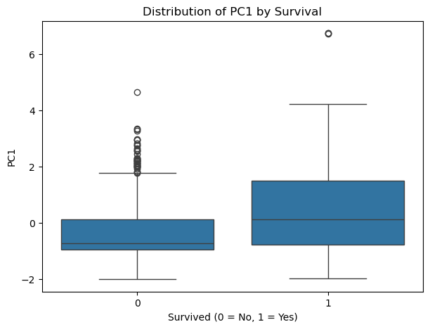

# Multidimensional and Text analysis on titanic data

## 1. PCA (Principal Component Analysis)

- `Данные`: Titanic dataset (891 пассажир)
- `Целевая` переменная: `Survived` (2 уникальных значения: 0 — не выжил, 1 — выжил)
- `Выбранные признаки для анализа`: `Pclass, Age, SibSp, Parch, Fare`
- `Преобработка данных`:
  - Пропущенные значения в `Age` заменены на среднее.
  - Масштабирование данных с использованием `StandardScaler`.
- Результаты PCA:
  - Для сохранения 90% дисперсии необходимо 4 главные компоненты.
- Визуализация проекции на первые две главные компоненты:
  - Диаграмма рассеяния с цветом по Survived
    - 

## 2. Cluster Analysis (KMeans)
- `Метод`: KMeans с 2 кластерами
- `Данные`: PCA-преобразованные данные (4 компоненты)
- `Результаты`:
  - | Фактический класс | Кластер 0 | Кластер 1 |
    | ----------------- | --------- | --------- |
    | Не выжил (0)      | 445       | 104       |
    | Выжил (1)         | 195       | 147       |
- Визуализация кластеров на первых двух компонентах PCA:
  - 

## 3. Text Analysis

- Пример текста для анализа:
  ```txt
  "Natural Language Processing is a field of AI that focuses on the interaction between humans and computers using natural language. Text analysis is essential for extracting insights from textual data."
  ```

- Этапы предобработки:
  - Токенизация: `['natural', 'language', 'processing', 'field', 'ai', 'focuses', ...]`
  - Удаление стоп-слов: Оставлены только значимые слова.
  - Стемминг (Porter, Lancaster, Snowball):
    - | Стеммер   | Результат                                           |
      | --------- | --------------------------------------------------- |
      | Porter    | ['natur', 'languag', 'process', 'field', 'ai', ...] |
      | Lancaster | ['nat', 'langu', 'process', 'field', 'ai', ...]     |
      | Snowball  | ['natur', 'languag', 'process', 'field', 'ai', ...] |
  - Лемматизация (WordNetLemmatizer): `['natural', 'language', 'processing', 'field', 'ai', ...]`

Вывод:
- Стемминг более грубый, может укорачивать слова до нечитабельной формы.
- Лемматизация сохраняет морфологически корректные формы слов, что удобно для семантического анализа.

- Частотный анализ слов:
  - | Слово      | Частота |
    | ---------- | ------- |
    | natural    | 2       |
    | language   | 2       |
    | processing | 1       |
    | field      | 1       |
    | ai         | 1       |
    | focuses    | 1       |

Визуализация наиболее часто встречающихся слов в тексте:
- 

## Дополнительно корреляция PCA-компонент с выживаемостью

После применения метода главных компонент (PCA) была проведена оценка связи полученных компонент с целевой переменной Survived, отражающей факт выживания пассажиров (0 — не выжил, 1 — выжил).

Для анализа была рассчитана корреляция между каждой главной компонентой и целевой переменной. Результаты показали, что первая главная компонента (PC1) имеет наибольшую связь с показателем выживаемости, в то время как остальные компоненты демонстрируют значительно более слабую зависимость.

- | PC         | Коэфф    |
  | ---------- | -------  |
  | PC1        | 0.265081 |
  | PC2        | 0.128957 |
  | PC3        | 0.218962 |
  | PC4        | 0.092571 |

Дополнительно для наглядного анализа был построен boxplot, отображающий распределение значений PC1 отдельно для выживших и невыживших пассажиров. Полученная визуализация показывает, что медианное значение PC1 у выживших пассажиров выше, чем у пассажиров, не переживших катастрофу. Это указывает на наличие зависимости между первой главной компонентой и вероятностью выживания.



Анализ нагрузок PCA показал, что первая главная компонента в основном формируется признаками Fare (стоимость билета) и Pclass (класс пассажира). Таким образом, PC1 может быть интерпретирована как показатель социального статуса пассажира. Полученные результаты позволяют сделать вывод о том, что пассажиры с более высоким социальным статусом имели большую вероятность выживания, что согласуется с историческими данными о катастрофе «Титаника».
